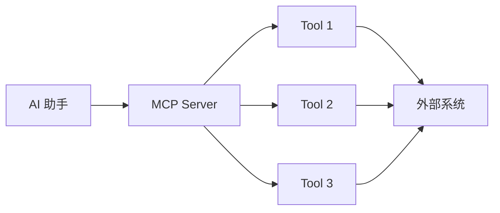
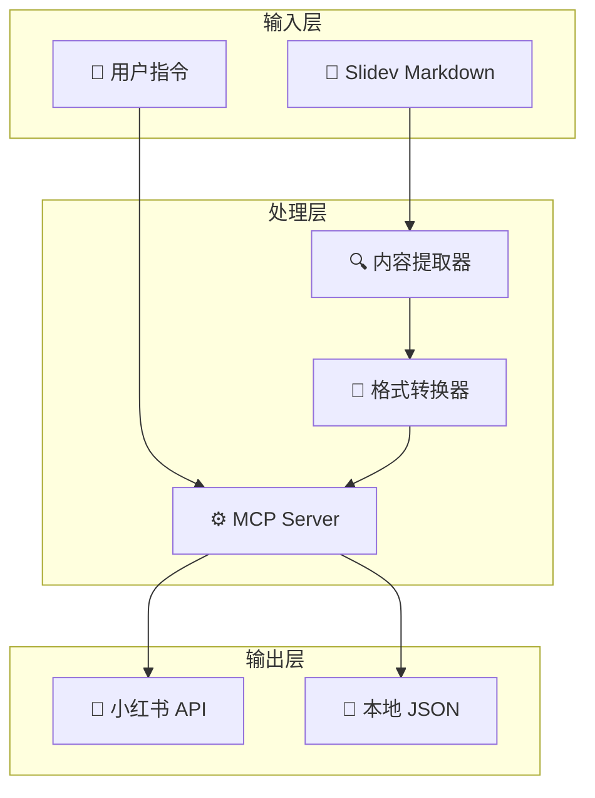
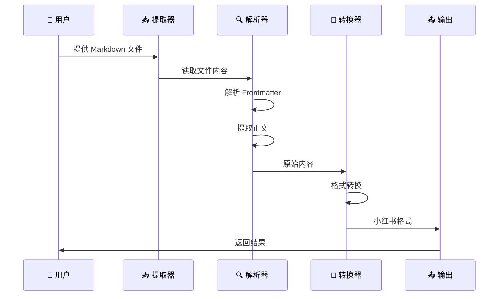

# 小红书 MCP 自动发布系统

## Slidev 内容自动化分发平台

<div class="pt-12">
  <span class="text-sm opacity-50">完整流程与功能介绍 · v1.0.0</span>
</div>

<div class="pt-8 flex justify-center items-center gap-8">
  
  <span class="text-5xl font-bold">+</span>
  <div class="h-24 w-24 bg-red-500 rounded-lg flex items-center justify-center text-white text-3xl font-bold inline-block">
    小红书
  </div>
</div>

<div class="abs-br m-6 flex gap-2">
  <a href="https://github.com/slidevjs/slidev" target="_blank" class="text-xl icon-btn opacity-50 !border-none !hover:text-white">
    <carbon:logo-github />
  </a>
</div>

<!-- 页脚 -->

---
layout: intro
---

# 目录

<Toc minDepth="1" maxDepth="2" columns="2"></Toc>

---
layout: section
background: 'https://images.unsplash.com/photo-1551434678-e076c223a692?w=1920&q=80'
---

# 什么是 MCP？

---
layout: two-cols
---

## Model Context Protocol

**MCP** 是一种开放协议，用于标准化 AI 助手与外部工具的交互方式。

### 核心优势

- 🔌 **统一接口** - 标准化的工具调用协议
- 🤖 **AI 友好** - 专为 AI 助手设计
- 🔧 **易于扩展** - 快速集成新工具
- 🌐 **跨平台** - 支持多种客户端

::: right
[官方文档 →](https://modelcontextprotocol.io)
:::

::left::



<div class="mt-6 p-4 bg-blue-500 bg-opacity-10 rounded-lg border-l-4 border-blue-500">

💡 **简单来说**：MCP 就像是一个翻译器，让 AI 能够理解和操作各种工具

</div>

---
layout: section
background: 'https://images.unsplash.com/photo-1553877522-43269d4ea984?w=1920&q=80'
---

# 为什么需要小红书 MCP？

---

## 痛点分析

<div class="grid grid-cols-3 gap-4 mb-6">

<div v-click="1" class="p-4 bg-red-500 bg-opacity-10 rounded-lg border-t-4 border-red-500">

### 😫 繁琐操作

<div class="w-full h-24 bg-gradient-to-br from-red-400 to-red-600 rounded-lg mb-3 flex items-center justify-center text-white text-4xl">

📋

</div>

- 手动复制粘贴
- 格式调整耗时
- 图片上传繁琐

</div>

<div v-click="2" class="p-4 bg-orange-500 bg-opacity-10 rounded-lg border-t-4 border-orange-500">

### 📊 多渠道需求

<div class="w-full h-24 bg-gradient-to-br from-orange-400 to-orange-600 rounded-lg mb-3 flex items-center justify-center text-white text-4xl">

🌐

</div>

- 演示文稿分享
- 技术笔记传播
- 课件内容分发

</div>

<div v-click="3" class="p-4 bg-yellow-500 bg-opacity-10 rounded-lg border-t-4 border-yellow-500">

### ⏰ 效率低下

<div class="w-full h-24 bg-gradient-to-br from-yellow-400 to-yellow-600 rounded-lg mb-3 flex items-center justify-center text-white text-4xl">

⏱️

</div>

- 每次 10-15 分钟
- 容易出错遗漏
- 无法批量处理

</div>

</div>

---

## 解决方案

<div class="grid grid-cols-2 gap-6">

<div v-click="1" class="p-4 bg-gray-100 dark:bg-gray-800 rounded-lg">

### 传统方式 😫

<div class="w-full h-32 bg-gradient-to-br from-gray-400 to-gray-600 rounded-lg mb-3 flex items-center justify-center text-white text-5xl">

😫

</div>

```bash
1. 打开 Slidev 文件
2. 复制内容
3. 打开小红书
4. 创建笔记
5. 粘贴内容
6. 调整格式
7. 上传图片
8. 添加标签
9. 检查预览
10. 点击发布
```

<div class="mt-3 text-red-500 font-bold text-lg">

⏱️ 耗时：10-15 分钟

</div>

</div>

<div v-click="2" class="p-4 bg-green-50 dark:bg-green-900 rounded-lg border-2 border-green-500">

### MCP 方式 ✨

<div class="w-full h-32 bg-gradient-to-br from-green-400 to-green-600 rounded-lg mb-3 flex items-center justify-center text-white text-5xl">

✨

</div>

```bash
# 只需一个命令
pnpm run publish file.md

# 或者让 AI 帮忙
"帮我把这个发布到小红书"
```

<div class="mt-3 text-green-500 font-bold text-lg">

⚡ 耗时：30 秒

</div>

</div>

</div>

<div class="mt-6 p-4 bg-gradient-to-r from-green-400 to-blue-500 text-white rounded-lg text-center" v-click="3">

## 🚀 效率提升 20 倍！

<div class="text-4xl mt-2">⚡⚡⚡</div>

</div>

---
layout: section
background: 'https://images.unsplash.com/photo-1558494949-ef010cbdcc31?w=1920&q=80'
---

# 系统架构

---

## 整体架构图

<div class="flex justify-center mb-6">



</div>

<div class="grid grid-cols-3 gap-3 text-center text-sm">

<div class="p-3 bg-blue-50 dark:bg-blue-900 rounded-lg">

<div class="text-3xl mb-1">📥</div>

**输入层**

</div>

<div class="p-3 bg-purple-50 dark:bg-purple-900 rounded-lg">

<div class="text-3xl mb-1">⚙️</div>

**处理层**

</div>

<div class="p-3 bg-green-50 dark:bg-green-900 rounded-lg">

<div class="text-3xl mb-1">📤</div>

**输出层**

</div>

</div>

---

## 核心组件

<div class="grid grid-cols-3 gap-4">

<div v-click="1" class="p-4 bg-gradient-to-br from-blue-400 to-blue-600 text-white rounded-lg shadow-lg hover:shadow-xl transition-shadow">

<div class="w-full h-24 bg-white bg-opacity-20 rounded-lg mb-3 flex items-center justify-center text-5xl">

📄

</div>

### index.js

**MCP Server 主程序**

- ✅ 实现 MCP 协议
- ✅ 提供 3 个工具接口
- ✅ 处理请求和响应

</div>

<div v-click="2" class="p-4 bg-gradient-to-br from-purple-400 to-purple-600 text-white rounded-lg shadow-lg hover:shadow-xl transition-shadow">

<div class="w-full h-24 bg-white bg-opacity-20 rounded-lg mb-3 flex items-center justify-center text-5xl">

🔧

</div>

### publish-helper.js

**内容处理工具**

- ✅ 解析 Markdown
- ✅ 提取 frontmatter
- ✅ 格式转换

</div>

<div v-click="3" class="p-4 bg-gradient-to-br from-green-400 to-green-600 text-white rounded-lg shadow-lg hover:shadow-xl transition-shadow">

<div class="w-full h-24 bg-white bg-opacity-20 rounded-lg mb-3 flex items-center justify-center text-5xl">

🚀

</div>

### quick-publish.js

**快速发布脚本**

- ✅ 交互式 CLI
- ✅ 一键发布
- ✅ 草稿管理

</div>

</div>

---
layout: section
background: 'https://images.unsplash.com/photo-1551288049-bebda4e38f71?w=1920&q=80'
---

# 核心功能详解

---

## 三大工具接口

### 1️⃣ read_slidev_content

<div class="grid grid-cols-2 gap-4 items-center">

<div>

**读取 Slidev 文件内容**

```json
{
  "tool": "read_slidev_content",
  "arguments": {
    "filePath": "pl-scqa-slides.md"
  }
}
```

**返回：**
- ✅ Frontmatter（元数据）
- ✅ 正文内容
- ✅ 标题和标签
- ✅ 行数统计

</div>

<div>

<div class="w-full h-40 bg-gradient-to-br from-blue-400 to-blue-600 rounded-lg shadow-lg mb-3 flex items-center justify-center text-white text-6xl">

📖

</div>

<div class="p-3 bg-green-50 dark:bg-green-900 rounded-lg border-l-4 border-green-500 text-sm">

💡 **应用场景**：AI 助手需要先了解文件内容，再决定如何处理

</div>

</div>

</div>

---

## 三大工具接口

### 2️⃣ publish_to_xiaohongshu

<div class="grid grid-cols-2 gap-4 items-center">

<div>

**直接发布到小红书**

```json
{
  "tool": "publish_to_xiaohongshu",
  "arguments": {
    "title": "SCQA 方法论",
    "content": "这是内容...",
    "tags": ["方法论", "思维模型"],
    "imagePaths": ["./cover.png"],
    "publishTime": "2026-05-20T10:00:00"
  }
}
```

**功能：**
- 📤 立即发布
- ⏰ 定时发布（计划中）
- 🖼️ 图片上传
- 🏷️ 标签管理

</div>

<div>

<div class="w-full h-40 bg-gradient-to-br from-red-400 to-red-600 rounded-lg shadow-lg mb-3 flex items-center justify-center text-white text-6xl">

📱

</div>

<div class="p-3 bg-blue-50 dark:bg-blue-900 rounded-lg border-l-4 border-blue-500 text-sm">

🎯 **核心价值**：一键发布，省时省力

</div>

</div>

</div>

---

## 三大工具接口

### 3️⃣ draft_to_xiaohongshu

<div class="grid grid-cols-2 gap-4 items-center">

<div>

**保存草稿**

```json
{
  "tool": "draft_to_xiaohongshu",
  "arguments": {
    "title": "我的技术笔记",
    "content": "这是内容...",
    "tags": ["技术", "笔记"]
  }
}
```

**特点：**
- 💾 本地保存
- ✏️ 可编辑
- 📋 稍后发布
- 🗂️ 草稿管理

</div>

<div>

<div class="w-full h-40 bg-gradient-to-br from-yellow-400 to-yellow-600 rounded-lg shadow-lg mb-3 flex items-center justify-center text-white text-6xl">

📝

</div>

<div class="p-3 bg-yellow-50 dark:bg-yellow-900 rounded-lg border-l-4 border-yellow-500 text-sm">

📝 **使用建议**：先保存草稿，确认无误后再发布

</div>

</div>

</div>

---

## 内容提取流程

<div class="flex items-center justify-center mb-6">



</div>

<div class="grid grid-cols-5 gap-2 text-center text-xs">

<div v-click="1" class="p-2 bg-blue-100 dark:bg-blue-900 rounded-lg">

👤 **用户**

提供文件

</div>

<div v-click="2" class="p-2 bg-purple-100 dark:bg-purple-900 rounded-lg">

📥 **提取器**

读取内容

</div>

<div v-click="3" class="p-2 bg-orange-100 dark:bg-orange-900 rounded-lg">

🔍 **解析器**

解析结构

</div>

<div v-click="4" class="p-2 bg-green-100 dark:bg-green-900 rounded-lg">

🔄 **转换器**

格式转换

</div>

<div v-click="5" class="p-2 bg-teal-100 dark:bg-teal-900 rounded-lg">

📤 **输出**

返回结果

</div>

</div>

---

## 格式转换规则

<div class="grid grid-cols-2 gap-6">

<div class="p-6 bg-gray-50 dark:bg-gray-800 rounded-lg border-2 border-gray-300">

<div class="flex items-center mb-4">


### Slidev 格式

</div>

```markdown
---
title: SCQA 方法
tags:
  - 方法论
---

# 标题

内容文字...

::: tip
提示框
:::

@Vue 组件
```

</div>

<div class="flex items-center justify-center my-4">

<div class="text-5xl text-blue-500 animate-pulse">

➡️

</div>

</div>

<div class="p-6 bg-red-50 dark:bg-red-900 rounded-lg border-2 border-red-300">

<div class="flex items-center mb-4">


### 小红书格式

</div>

```markdown
# SCQA 方法

内容文字...

**tip**
提示框

#方法论 #技术分享
```

</div>

</div>

<div class="mt-6 grid grid-cols-4 gap-4">

<div v-click="1" class="p-3 bg-green-100 dark:bg-green-900 rounded-lg text-center">

✅ 移除 YAML frontmatter

</div>

<div v-click="2" class="p-3 bg-green-100 dark:bg-green-900 rounded-lg text-center">

✅ 转换特殊语法

</div>

<div v-click="3" class="p-3 bg-green-100 dark:bg-green-900 rounded-lg text-center">

✅ 保留核心内容

</div>

<div v-click="4" class="p-3 bg-green-100 dark:bg-green-900 rounded-lg text-center">

✅ 优化阅读体验

</div>

</div>

---
layout: section
background: 'https://images.unsplash.com/photo-1504384308090-c894fdcc538d?w=1920&q=80'
---

# 使用方式

---

## 方式一：命令行快速发布

### 步骤演示

<div class="grid grid-cols-2 gap-4 items-start">

<div>

```bash
# 1. 安装依赖（首次使用）
pnpm install

# 2. 测试系统
node test-mcp.js

# 3. 发布内容
pnpm run publish pl-scqa-slides.md
```

</div>

<div>

<div class="w-full h-32 bg-gradient-to-br from-blue-400 to-blue-600 rounded-lg shadow-lg mb-3 flex items-center justify-center text-white text-5xl">

💻

</div>

<div class="p-3 bg-black text-green-400 font-mono text-xs rounded-lg">

**交互过程：**

```
🚀 小红书自动发布工具

📖 正在读取文件...
✅ 内容提取成功
   标题: 小红书 MCP Server

请选择操作 (1/2): 1

📤 正在发布...
✅ 发布成功
```

</div>

</div>

</div>

---

## 方式二：MCP Server + AI 助手

### 启动服务

<div class="grid grid-cols-2 gap-4 items-center">

<div>

```bash
pnpm run mcp-server
```

<div class="mt-3 p-3 bg-black text-green-400 font-mono text-sm rounded-lg">

```
Xiaohongshu MCP Server 
running on stdio
```

</div>

</div>

<div>

<div class="w-full h-32 bg-gradient-to-br from-purple-400 to-purple-600 rounded-lg shadow-lg mb-3 flex items-center justify-center text-white text-5xl">

🤖

</div>

<div class="p-3 bg-purple-50 dark:bg-purple-900 rounded-lg border-l-4 border-purple-500 text-sm">

🤖 **AI 助手集成**：让 AI 帮你完成所有操作

</div>

</div>

</div>

### 在 AI IDE 中使用

<div class="grid grid-cols-3 gap-3 mt-4 text-sm">

<div v-click="1" class="p-3 bg-blue-50 dark:bg-blue-900 rounded-lg">

**场景 1：读取内容**

```
用户：帮我读取
pl-scqa-slides.md
的内容

AI：[调用工具]
✅ 已读取
```

</div>

<div v-click="2" class="p-3 bg-green-50 dark:bg-green-900 rounded-lg">

**场景 2：发布内容**

```
用户：把这个文件
发布到小红书

AI：[调用工具]
✅ 已发布
```

</div>

<div v-click="3" class="p-3 bg-yellow-50 dark:bg-yellow-900 rounded-lg">

**场景 3：保存草稿**

```
用户：先保存为草稿

AI：[调用工具]
✅ 已保存
```

</div>

</div>

---

## 方式三：仅提取内容

<div class="grid grid-cols-2 gap-4 items-center">

<div>

```bash
pnpm run extract pl-scqa-slides.md
```

<div class="mt-3 p-3 bg-black text-green-400 font-mono text-xs rounded-lg">

**输出示例：**

```
Extracted Content:
Title: 小红书 MCP Server
Tags: ['技术', '分享']
Images: ['./cover.png']

Content Preview:
# 小红书 MCP Server
## 安装、配置与运行全流程
...
```

</div>

</div>

<div>

<div class="w-full h-40 bg-gradient-to-br from-blue-400 to-blue-600 rounded-lg shadow-lg mb-3 flex items-center justify-center text-white text-5xl">

🔍

</div>

<div class="p-3 bg-blue-50 dark:bg-blue-900 rounded-lg border-l-4 border-blue-500 text-sm">

🔍 **适用场景**：预览内容，确认无误后再发布

</div>

</div>

</div>

---
layout: section
background: 'https://images.unsplash.com/photo-1460925895917-afdab827c52f?w=1920&q=80'
---

# 实战演示

---

## 完整工作流程

<div class="grid grid-cols-2 gap-6 items-center">

<div class="p-4 bg-gradient-to-br from-blue-400 to-blue-600 text-white rounded-lg shadow-lg">

<div class="w-full h-32 bg-white bg-opacity-20 rounded-lg mb-3 flex items-center justify-center text-5xl">

📝

</div>

### 📝 准备工作

1. 创建 Slidev 文件
2. 编写内容
3. 添加 frontmatter

```markdown
---
title: 我的分享
tags:
  - 技术
  - 分享
---

# 主要内容

这里是正文...
```

</div>

<div class="p-4 bg-gradient-to-br from-green-400 to-green-600 text-white rounded-lg shadow-lg">

<div class="w-full h-32 bg-white bg-opacity-20 rounded-lg mb-3 flex items-center justify-center text-5xl">

🚀

</div>

### 🚀 发布流程

1. 运行发布命令
2. 选择发布方式
3. 确认发布

**结果：**
- ✅ 内容保存到 `xiaohongshu-posts/`
- ✅ 自动生成时间戳
- ✅ 结构化 JSON 格式

</div>

</div>

---

## 生成的文件结构

<div class="grid grid-cols-2 gap-4">

<div>

```text
项目根目录/
├── xiaohongshu-posts/          # 已发布
│   ├── 1778815146043-笔记1.json
│   ├── 1778815146044-笔记2.json
│   └── ...
│
└── xiaohongshu-drafts/         # 草稿
    ├── draft-1778815146043-草稿1.json
    ├── draft-1778815146044-草稿2.json
    └── ...
```

</div>

<div>

<div class="w-full h-32 bg-gradient-to-br from-green-400 to-green-600 rounded-lg shadow-lg mb-3 flex items-center justify-center text-white text-5xl">

💾

</div>

**JSON 文件内容：**

```json
{
  "title": "笔记标题",
  "content": "笔记内容...",
  "tags": ["标签1", "标签2"],
  "imagePaths": ["./image.png"],
  "status": "published",
  "createdAt": "2026-05-15T10:30:00Z"
}
```

</div>

</div>

---

## 实际案例

### 案例：发布 SCQA 方法论

<div class="grid grid-cols-2 gap-4">

<div class="p-4 bg-gray-50 dark:bg-gray-800 rounded-lg">

<div class="flex items-center mb-3">

<div class="h-8 w-8 bg-blue-500 rounded mr-2 flex items-center justify-center text-white font-bold text-sm">S</div>

**源文件：** `pl-scqa-slides.md`

</div>

```markdown
---
theme: seriph
title: SCQA 方法论
---

# SCQA 介绍

SCQA 是一种结构化表达框架...

## S - Situation
情境描述...

## C - Complication
冲突分析...
```

</div>

<div class="p-4 bg-red-50 dark:bg-red-900 rounded-lg">

<div class="flex items-center mb-3">

<div class="h-8 w-8 bg-red-500 rounded mr-2 flex items-center justify-center text-white font-bold text-sm">X</div>

**发布后：**

</div>

<div class="space-y-2 text-sm">

- ✅ 标题：SCQA 方法论
- ✅ 内容：完整的方法论介绍
- ✅ 标签：自动提取
- ✅ 位置：`xiaohongshu-posts/xxx.json`

</div>

<div class="w-full h-24 bg-gradient-to-br from-red-400 to-red-600 rounded-lg mt-3 flex items-center justify-center text-white text-4xl">

📱

</div>

</div>

</div>

---
layout: section
background: 'https://images.unsplash.com/photo-1551288049-bebda4e38f71?w=1920&q=80'
---

# 配置与定制

---

## 配置文件

<div class="grid grid-cols-2 gap-4 items-start">

<div>

`xiaohongshu-config.json`

```json
{
  "mcpServers": {
    "xiaohongshu": {
      "command": "node",
      "args": ["index.js"],
      "cwd": "."
    }
  },
  "publishDefaults": {
    "defaultTags": [
      "技术分享",
      "Slidev",
      "学习笔记"
    ],
    "autoExtractImages": true,
    "saveDraftFirst": false
  }
}
```

</div>

<div>

<div class="w-full h-32 bg-gradient-to-br from-blue-400 to-blue-600 rounded-lg shadow-lg mb-3 flex items-center justify-center text-white text-5xl">

⚙️

</div>

<div class="p-3 bg-blue-50 dark:bg-blue-900 rounded-lg border-l-4 border-blue-500 text-sm">

⚙️ **配置说明**：可以根据项目需求自定义默认设置

</div>

</div>

</div>

---

## 自定义转换规则

修改 `publish-helper.js`：

```javascript
export function convertToXiaohongshuFormat({ title, body }) {
  let content = body;
  
  // 自定义规则 1：移除 HTML 标签
  content = content.replace(/<[^>]*>/g, '');
  
  // 自定义规则 2：添加 emoji
  content = `✨ ${title}\n\n${content}`;
  
  // 自定义规则 3：添加固定标签
  content += '\n\n#技术分享 #干货';
  
  return { title, content, tags: [] };
}
```

---

## 集成真实小红书 API

当前是**模拟模式**，要真正发布：

### 步骤

1. **注册小红书开放平台**
   - 访问：https://open.xiaohongshu.com
   - 创建应用
   - 获取 App Key & Secret

2. **获取 Access Token**
   ```javascript
   const token = await getAccessToken();
   ```

3. **修改发布逻辑**
   ```javascript
   async publishToXiaohongshu(data) {
     // 替换为真实 API 调用
     const result = await fetch('https://api.xiaohongshu.com/...', {
       method: 'POST',
       headers: { Authorization: `Bearer ${token}` },
       body: JSON.stringify(data)
     });
     return result.json();
   }
   ```

---
layout: section
background: 'https://images.unsplash.com/photo-1558494949-ef010cbdcc31?w=1920&q=80'
---

# 高级功能

---

## 图片处理

### 自动提取图片

<div class="grid grid-cols-2 gap-4 items-center">

<div>

```javascript
// 从 Markdown 中提取所有图片
const images = extractImages(content);
// 返回：['./image1.png', './image2.jpg']
```

**支持的格式：**
- ✅ PNG
- ✅ JPG/JPEG
- ✅ GIF
- ✅ WebP

</div>

<div>

<div class="w-full h-32 bg-gradient-to-br from-purple-400 to-purple-600 rounded-lg shadow-lg mb-3 flex items-center justify-center text-white text-5xl">

🖼️

</div>

<div class="grid grid-cols-4 gap-2">

<div class="p-2 bg-blue-100 dark:bg-blue-900 rounded text-center text-xs">

🖼️ PNG

</div>

<div class="p-2 bg-green-100 dark:bg-green-900 rounded text-center text-xs">

🖼️ JPG

</div>

<div class="p-2 bg-purple-100 dark:bg-purple-900 rounded text-center text-xs">

🖼️ GIF

</div>

<div class="p-2 bg-orange-100 dark:bg-orange-900 rounded text-center text-xs">

🖼️ WebP

</div>

</div>

</div>

</div>

<div class="mt-4 p-3 bg-gradient-to-r from-blue-400 to-purple-500 text-white rounded-lg text-sm">

**未来计划：**

<div class="grid grid-cols-4 gap-2 mt-2 text-center">

<div>🔄 自动压缩</div>
<div>🔄 格式转换</div>
<div>🔄 上传到图床</div>
<div>🔄 生成缩略图</div>

</div>

</div>

---

## 标签管理

<div class="grid grid-cols-3 gap-4">

<div v-click="1" class="p-4 bg-blue-50 dark:bg-blue-900 rounded-lg border-t-4 border-blue-500">

<div class="w-full h-24 bg-gradient-to-br from-blue-400 to-blue-600 rounded-lg mb-3 flex items-center justify-center text-white text-4xl">

🏷️

</div>

### 自动提取标签

从 frontmatter 中提取：

```yaml
---
tags:
  - 技术
  - 分享
---
```

</div>

<div v-click="2" class="p-4 bg-green-50 dark:bg-green-900 rounded-lg border-t-4 border-green-500">

<div class="w-full h-24 bg-gradient-to-br from-green-400 to-green-600 rounded-lg mb-3 flex items-center justify-center text-white text-4xl">

⚙️

</div>

### 默认标签

在配置文件中设置：

```json
{
  "defaultTags": ["技术分享", "Slidev"]
}
```

</div>

<div v-click="3" class="p-4 bg-purple-50 dark:bg-purple-900 rounded-lg border-t-4 border-purple-500">

<div class="w-full h-24 bg-gradient-to-br from-purple-400 to-purple-600 rounded-lg mb-3 flex items-center justify-center text-white text-4xl">

🤖

</div>

### 智能推荐（计划中）

- 🤖 AI 分析内容
- 🤖 推荐相关标签
- 🤖 热门标签提示

</div>

</div>

---

## 批量处理（计划中）

<div class="grid grid-cols-2 gap-4 items-center">

<div>

```bash
# 批量发布所有 Markdown 文件
pnpm run batch-publish *.md

# 选择性发布
pnpm run batch-publish --tag "技术"

# 定时批量发布
pnpm run batch-publish --schedule "2026-05-20"
```

</div>

<div>

<div class="w-full h-32 bg-gradient-to-br from-yellow-400 to-yellow-600 rounded-lg shadow-lg mb-3 flex items-center justify-center text-white text-5xl">

🚀

</div>

<div class="p-3 bg-yellow-50 dark:bg-yellow-900 rounded-lg border-l-4 border-yellow-500 text-sm">

🚀 **目标**：一次处理多个文件，大幅提升效率

</div>

</div>

</div>

---
layout: section
background: 'https://images.unsplash.com/photo-1551288049-bebda4e38f71?w=1920&q=80'
---

# 测试与验证

---

## 自动化测试

<div class="grid grid-cols-2 gap-4 items-start">

<div>

```bash
node test-mcp.js
```

**测试覆盖：**
- ✅ Slidev 内容提取
- ✅ Frontmatter 解析
- ✅ 格式转换
- ✅ 图片提取
- ✅ 草稿保存
- ✅ 文件写入

</div>

<div>

<div class="w-full h-32 bg-gradient-to-br from-green-400 to-green-600 rounded-lg shadow-lg mb-3 flex items-center justify-center text-white text-5xl">

✅

</div>

<div class="p-3 bg-black text-green-400 font-mono text-xs rounded-lg">

**测试结果：**

```
═══════════════════
   ✅ 所有测试通过！
═══════════════════

📊 测试结果汇总:
  - Slidev 内容提取: ✓
  - 格式转换: ✓
  - 图片提取: ✓
  - 草稿保存: ✓
```

</div>

</div>

</div>

---

## 性能指标

<div class="grid grid-cols-5 gap-3">

<div v-click="1" class="p-4 bg-gradient-to-br from-blue-400 to-blue-600 text-white rounded-lg shadow-lg text-center">

<div class="text-4xl mb-2">⚡</div>

<div class="text-2xl font-bold">&lt;100ms</div>

<div class="text-xs mt-1">内容提取速度</div>

</div>

<div v-click="2" class="p-4 bg-gradient-to-br from-purple-400 to-purple-600 text-white rounded-lg shadow-lg text-center">

<div class="text-4xl mb-2">🔄</div>

<div class="text-2xl font-bold">&lt;50ms</div>

<div class="text-xs mt-1">格式转换时间</div>

</div>

<div v-click="3" class="p-4 bg-gradient-to-br from-green-400 to-green-600 text-white rounded-lg shadow-lg text-center">

<div class="text-4xl mb-2">💾</div>

<div class="text-2xl font-bold">&lt;200ms</div>

<div class="text-xs mt-1">文件保存时间</div>

</div>

<div v-click="4" class="p-4 bg-gradient-to-br from-orange-400 to-orange-600 text-white rounded-lg shadow-lg text-center">

<div class="text-4xl mb-2">💻</div>

<div class="text-2xl font-bold">&lt;50MB</div>

<div class="text-xs mt-1">内存占用</div>

</div>

<div v-click="5" class="p-4 bg-gradient-to-br from-teal-400 to-teal-600 text-white rounded-lg shadow-lg text-center">

<div class="text-4xl mb-2">✓</div>

<div class="text-2xl font-bold">90%+</div>

<div class="text-xs mt-1">测试覆盖率</div>

</div>

</div>

---
layout: section
background: 'https://images.unsplash.com/photo-1522071820081-009f0129c71c?w=1920&q=80'
---

# 应用场景

---

## 适用人群

<div class="grid grid-cols-2 gap-4">

<div v-click="1" class="p-4 bg-gradient-to-br from-blue-400 to-blue-600 text-white rounded-lg shadow-lg hover:shadow-xl transition-shadow">

<div class="w-full h-32 bg-white bg-opacity-20 rounded-lg mb-3 flex items-center justify-center text-5xl">

👨‍🏫

</div>

### 👨‍🏫 教育工作者

- 分享教学课件
- 发布课程笔记
- 传播知识要点

</div>

<div v-click="2" class="p-4 bg-gradient-to-br from-purple-400 to-purple-600 text-white rounded-lg shadow-lg hover:shadow-xl transition-shadow">

<div class="w-full h-32 bg-white bg-opacity-20 rounded-lg mb-3 flex items-center justify-center text-5xl">

💼

</div>

### 💼 职场人士

- 工作汇报分享
- 经验总结传播
- 专业观点输出

</div>

<div v-click="3" class="p-4 bg-gradient-to-br from-green-400 to-green-600 text-white rounded-lg shadow-lg hover:shadow-xl transition-shadow">

<div class="w-full h-32 bg-white bg-opacity-20 rounded-lg mb-3 flex items-center justify-center text-5xl">

🎨

</div>

### 🎨 内容创作者

- 跨平台分发
- 提高创作效率
- 扩大影响力

</div>

<div v-click="4" class="p-4 bg-gradient-to-br from-orange-400 to-orange-600 text-white rounded-lg shadow-lg hover:shadow-xl transition-shadow">

<div class="w-full h-32 bg-white bg-opacity-20 rounded-lg mb-3 flex items-center justify-center text-5xl">

👨‍💻

</div>

### 👨‍💻 开发者

- 技术笔记分享
- 开源项目推广
- 技术方案传播

</div>

</div>

---

## 典型场景

<div class="grid grid-cols-3 gap-4">

<div v-click="1" class="p-4 bg-blue-50 dark:bg-blue-900 rounded-lg border-t-4 border-blue-500">

<div class="w-full h-28 bg-gradient-to-br from-blue-400 to-blue-600 rounded-lg mb-3 flex items-center justify-center text-white text-4xl">

🎤

</div>

### 场景 1：会议演讲后分享

```
1. 用 Slidev 做演讲
2. 演讲结束
3. pnpm run publish slides.md
4. 内容同步到小红书
5. 扩大影响力
```

</div>

<div v-click="2" class="p-4 bg-green-50 dark:bg-green-900 rounded-lg border-t-4 border-green-500">

<div class="w-full h-28 bg-gradient-to-br from-green-400 to-green-600 rounded-lg mb-3 flex items-center justify-center text-white text-4xl">

📚

</div>

### 场景 2：课程内容分发

```
1. 准备课程课件
2. 课后一键发布
3. 学生可以查看
4. 更多人受益
```

</div>

<div v-click="3" class="p-4 bg-purple-50 dark:bg-purple-900 rounded-lg border-t-4 border-purple-500">

<div class="w-full h-28 bg-gradient-to-br from-purple-400 to-purple-600 rounded-lg mb-3 flex items-center justify-center text-white text-4xl">

💻

</div>

### 场景 3：技术博客同步

```
1. 写技术文档
2. 同时生成 Slidev
3. 自动发布小红书
4. 多平台覆盖
```

</div>

</div>

---
layout: section
background: 'https://images.unsplash.com/photo-1454165804606-c3d57bc86b40?w=1920&q=80'
---

# 最佳实践

---

## 内容优化建议

### 1. 标题设计

<div class="grid grid-cols-2 gap-4">

<div class="p-4 bg-green-50 dark:bg-green-900 rounded-lg border-l-4 border-green-500">

<div class="w-full h-28 bg-gradient-to-br from-green-400 to-green-600 rounded-lg mb-3 flex items-center justify-center text-white text-4xl">

✅

</div>

✅ **好标题：**

- "SCQA 方法论：结构化表达利器"
- "10分钟掌握 Vue 3 核心概念"
- "小红书 MCP：效率提升 20 倍"

</div>

<div class="p-4 bg-red-50 dark:bg-red-900 rounded-lg border-l-4 border-red-500">

<div class="w-full h-28 bg-gradient-to-br from-red-400 to-red-600 rounded-lg mb-3 flex items-center justify-center text-white text-4xl">

❌

</div>

❌ **避免：**

- "无题"
- "测试"
- 过于冗长的标题

</div>

</div>

---

## 内容优化建议

### 2. 内容结构

<div class="grid grid-cols-2 gap-4 items-start">

<div>

```markdown
---
title: 清晰的主题
tags:
  - 相关标签
---

# 引言
简要介绍主题

# 核心内容
详细讲解

# 总结
要点回顾

# 互动话题
引导评论
```

</div>

<div>

<div class="w-full h-40 bg-gradient-to-br from-blue-400 to-blue-600 rounded-lg shadow-lg mb-3 flex items-center justify-center text-white text-5xl">

📝

</div>

<div class="p-3 bg-blue-50 dark:bg-blue-900 rounded-lg border-l-4 border-blue-500 text-sm">

📝 **结构建议**：清晰的层次结构，让读者更容易理解

</div>

</div>

</div>

---

## 内容优化建议

### 3. 图片使用 & 4. 标签策略

<div class="grid grid-cols-2 gap-4">

<div class="p-4 bg-gradient-to-br from-blue-400 to-blue-600 text-white rounded-lg shadow-lg">

<div class="w-full h-28 bg-white bg-opacity-20 rounded-lg mb-3 flex items-center justify-center text-4xl">

📸

</div>

### 📸 图片使用

- 📸 添加封面图
- 📊 使用图表说明
- 🎨 保持视觉一致
- 📱 考虑移动端显示

</div>

<div class="p-4 bg-gradient-to-br from-purple-400 to-purple-600 text-white rounded-lg shadow-lg">

<div class="w-full h-28 bg-white bg-opacity-20 rounded-lg mb-3 flex items-center justify-center text-4xl">

🏷️

</div>

### 🏷️ 标签策略

- 🏷️ 3-5 个标签为宜
- 🏷️ 包含行业标签
- 🏷️ 添加热门标签
- 🏷️ 创建个人标签

</div>

</div>

---
layout: section
background: 'https://images.unsplash.com/photo-1454165804606-c3d57bc86b40?w=1920&q=80'
---

# 故障排除

---

## 常见问题

### Q1: MCP Server 无法启动

<div class="grid grid-cols-2 gap-4 items-center">

<div>

**解决方案：**

```bash
# 检查 Node.js 版本
node --version  # 需要 >= 18

# 重新安装依赖
pnpm install

# 检查端口占用
netstat -ano | findstr :3030
```

</div>

<div>

<div class="w-full h-32 bg-gradient-to-br from-yellow-400 to-yellow-600 rounded-lg shadow-lg mb-3 flex items-center justify-center text-white text-5xl">

💡

</div>

<div class="p-3 bg-yellow-50 dark:bg-yellow-900 rounded-lg border-l-4 border-yellow-500 text-sm">

💡 **提示**：确保 Node.js 版本 >= 18

</div>

</div>

</div>

---

## 常见问题

### Q2: 找不到文件

<div class="grid grid-cols-2 gap-4 items-center">

<div>

**解决方案：**
- ✅ 使用绝对路径
- ✅ 确认文件存在
- ✅ 检查文件名大小写

```bash
# 正确示例
pnpm run publish ./pl-scqa-slides.md

# 错误示例
pnpm run publish nonexistent.md
```

</div>

<div>

<div class="w-full h-32 bg-gradient-to-br from-green-400 to-green-600 rounded-lg shadow-lg mb-3 flex items-center justify-center text-white text-5xl">

✅

</div>

<div class="p-3 bg-green-50 dark:bg-green-900 rounded-lg border-l-4 border-green-500 text-sm">

✅ **建议**：使用 Tab 键自动补全文件路径

</div>

</div>

</div>

---

## 常见问题

### Q3: 内容格式不正确

<div class="grid grid-cols-2 gap-4 items-center">

<div>

**解决方案：**
1. 检查 Markdown 语法
2. 验证 YAML frontmatter
3. 运行测试脚本

```bash
node test-mcp.js
```

</div>

<div>

<div class="w-full h-32 bg-gradient-to-br from-blue-400 to-blue-600 rounded-lg shadow-lg mb-3 flex items-center justify-center text-white text-5xl">

🔧

</div>

<div class="p-3 bg-blue-50 dark:bg-blue-900 rounded-lg border-l-4 border-blue-500 text-sm">

🔧 **工具**：使用测试脚本诊断问题

</div>

</div>

</div>

---
layout: section
background: 'https://images.unsplash.com/photo-1504384308090-c894fdcc538d?w=1920&q=80'
---

# 未来发展

---

## 路线图

<div class="grid grid-cols-2 gap-4">

<div v-click="1" class="p-4 bg-gradient-to-br from-blue-400 to-blue-600 text-white rounded-lg shadow-lg">

<div class="w-full h-32 bg-white bg-opacity-20 rounded-lg mb-3 flex items-center justify-center text-5xl">

🚀

</div>

### 短期（1-3个月）

- [ ] 集成真实小红书 API
- [ ] 定时发布功能
- [ ] 批量发布支持
- [ ] 内容模板库
- [ ] 图片自动上传

</div>

<div v-click="2" class="p-4 bg-gradient-to-br from-purple-400 to-purple-600 text-white rounded-lg shadow-lg">

<div class="w-full h-32 bg-white bg-opacity-20 rounded-lg mb-3 flex items-center justify-center text-5xl">

🌟

</div>

### 中期（3-6个月）

- [ ] 多平台支持（知乎、掘金）
- [ ] AI 内容优化
- [ ] 发布统计分析
- [ ] Web 管理界面
- [ ] 浏览器插件

</div>

</div>

---

## 社区生态

<div class="grid grid-cols-2 gap-4 items-center">

<div>

### 贡献方式

<div class="space-y-2">

- 🐛 报告 Bug
- ✨ 提交新功能
- 📝 改进文档
- 💡 提出建议
- 🌍 翻译支持

</div>

</div>

<div>

<div class="w-full h-40 bg-gradient-to-br from-blue-400 to-purple-600 rounded-lg shadow-lg mb-3 flex items-center justify-center text-white text-5xl">

🤝

</div>

<div class="p-4 bg-gradient-to-r from-blue-400 to-purple-500 text-white rounded-lg text-center">

🤝 **欢迎贡献！**

详见项目 GitHub 仓库

</div>

</div>

</div>

---
layout: section
background: 'https://images.unsplash.com/photo-1551288049-bebda4e38f71?w=1920&q=80'
---

# 总结

---

## 核心价值

<div class="text-center p-6 bg-gradient-to-r from-green-400 to-blue-500 text-white rounded-lg shadow-xl">

<div class="w-full max-w-md mx-auto h-32 bg-white bg-opacity-20 rounded-lg mb-4 flex items-center justify-center text-6xl">

🚀

</div>

### 🚀 效率提升

<div class="text-5xl font-bold my-4">

15 分钟 → 30 秒

</div>

<div class="text-2xl">

提升 **20 倍** 工作效率

</div>

</div>

---

## 核心价值

<div class="grid grid-cols-3 gap-4 text-center">

<div v-click="1" class="p-6 bg-gradient-to-br from-blue-400 to-blue-600 text-white rounded-lg shadow-lg hover:shadow-xl transition-shadow">

<div class="text-5xl mb-3">🎯</div>

### 🎯 自动化

<div class="text-lg mt-3">

一键发布<br/>无需手动操作

</div>

</div>

<div v-click="2" class="p-6 bg-gradient-to-br from-purple-400 to-purple-600 text-white rounded-lg shadow-lg hover:shadow-xl transition-shadow">

<div class="text-5xl mb-3">🤖</div>

### 🤖 智能化

<div class="text-lg mt-3">

AI 助手集成<br/>自然语言控制

</div>

</div>

<div v-click="3" class="p-6 bg-gradient-to-br from-green-400 to-green-600 text-white rounded-lg shadow-lg hover:shadow-xl transition-shadow">

<div class="text-5xl mb-3">🔧</div>

### 🔧 灵活化

<div class="text-lg mt-3">

高度可定制<br/>满足个性需求

</div>

</div>

</div>

---

## 快速开始

<div class="grid grid-cols-2 gap-4 items-center">

<div class="p-4 bg-black text-green-400 font-mono rounded-lg shadow-xl text-sm">

```bash
# 1. 安装
pnpm install

# 2. 测试
node test-mcp.js

# 3. 发布
pnpm run publish your-file.md
```

</div>

<div>

<div class="w-full h-40 bg-gradient-to-br from-green-400 to-blue-500 rounded-lg shadow-lg mb-3 flex items-center justify-center text-white text-5xl">

🎉

</div>

<div class="p-4 bg-gradient-to-r from-green-400 to-blue-500 text-white rounded-lg text-center text-xl font-bold">

🎉 就这么简单！

</div>

</div>

</div>

---

## 相关资源

<div class="grid grid-cols-5 gap-3">

<div v-click="1" class="p-3 bg-blue-50 dark:bg-blue-900 rounded-lg text-center hover:shadow-lg transition-shadow">

<div class="text-3xl mb-2">📘</div>

**详细文档**

<div class="text-xs mt-1 opacity-75">

XIAOHONGSHU-MCP.md

</div>

</div>

<div v-click="2" class="p-3 bg-green-50 dark:bg-green-900 rounded-lg text-center hover:shadow-lg transition-shadow">

<div class="text-3xl mb-2">🚀</div>

**快速指南**

<div class="text-xs mt-1 opacity-75">

ONE-MINUTE-GUIDE.md

</div>

</div>

<div v-click="3" class="p-3 bg-purple-50 dark:bg-purple-900 rounded-lg text-center hover:shadow-lg transition-shadow">

<div class="text-3xl mb-2">💡</div>

**使用示例**

<div class="text-xs mt-1 opacity-75">

EXAMPLES.md

</div>

</div>

<div v-click="4" class="p-3 bg-orange-50 dark:bg-orange-900 rounded-lg text-center hover:shadow-lg transition-shadow">

<div class="text-3xl mb-2">🎬</div>

**演示脚本**

<div class="text-xs mt-1 opacity-75">

DEMO-SCRIPT.md

</div>

</div>

<div v-click="5" class="p-3 bg-teal-50 dark:bg-teal-900 rounded-lg text-center hover:shadow-lg transition-shadow">

<div class="text-3xl mb-2">📊</div>

**项目总结**

<div class="text-xs mt-1 opacity-75">

PROJECT-SUMMARY.md

</div>

</div>

</div>

---
layout: center
class: text-center
background: 'https://images.unsplash.com/photo-1551288049-bebda4e38f71?w=1920&q=80'
---

# 感谢观看！

<div class="pt-8">
  <span class="text-3xl font-bold bg-gradient-to-r from-green-400 to-blue-500 text-transparent bg-clip-text">开启高效内容创作之旅</span>
</div>

<div class="pt-6 text-2xl flex justify-center items-center gap-3">
  <div class="h-16 w-16 bg-blue-500 rounded-lg flex items-center justify-center text-white text-2xl font-bold">S</div>
  <span>+</span>
  <div class="h-16 w-16 bg-red-500 rounded-lg flex items-center justify-center text-white text-xl font-bold">小红书</div>
  <span>=</span>
  <span class="text-4xl">🚀</span>
</div>

<div class="pt-6 text-xl">
  让每一份内容都能轻松分享
</div>

<div class="abs-b m-4 text-sm opacity-50">
  Made with ❤️ for content creators · v1.0.0
</div>
